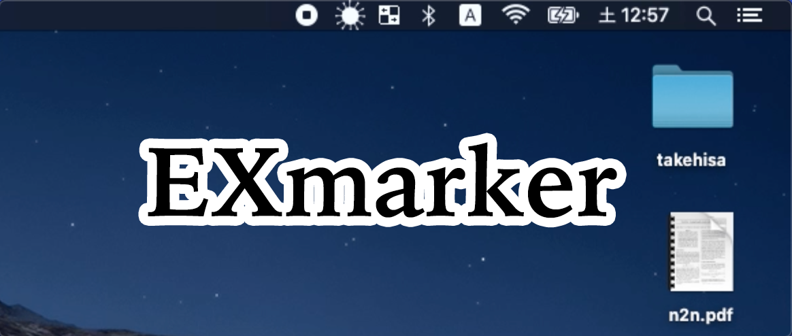

# EXmarker-拠点状況可視化ツール

## 製品概要
[紹介動画]https://youtu.be/5MuxgIoAsbM

### 背景(製品開発のきっかけ、課題等）
我々が所属している研究室では，研究室にあるPCを使ってリモートで研究できるため自分が研究室に赴くかどうかは自由である．しかしながら，人によっては家では研究のモチベーションが続かないといった問題がある．このような場合に研究室に行くのだが，研究室に正確に何人の人がいるかまではわからなくても、どれくらいの混雑状況なのかが気になるという背景からこのアイデアに至った．

### 製品説明（具体的な製品の説明）
広く使われているコミュニケーションアプリであるLINEで，専用のLINEbotを友達登録しておく．これだけで自分のよく行く場所やオフィスなど，自身のPCのステータスバーに混雑状況を可視化するツールです．コミュニティ拠点に在席している人数をビーコンで検知し，ユーザーPCのステータスバーに混雑状況を動くアイコンで3段階に表示します．オン・オフラインでのハイブリッドな活動形態において，リモート環境に居ながらコミュニティ拠点にどれだけの人が在席しているのかシームレスに認識できます．チームの連携をスムーズにするツールとしてご利用ください．

### アピールポイント
日々の研究生活から素直に欲しいと感じたものを実現しました！
生活に馴染むツールであることを重要視し、ユーザーが常に使いたいと思うようなUI・UXとして、見ていて気持ちの良いアイコンで混雑状況を表示しました！  
「知れたら便利だけどわざわざ調べるほどの情報ではない」そんな**痒いところに手が届くような**情報をステータスバーのアイコンを用いることでシームレスに伝えます！
アイコンの動きで癒されながら状況を把握できることが最大のアピールポイントです！！

### 特長
* 特長1: Macのステータスバーに混雑状況を三段階で可視化
* 特長2: LINEbotの登録だけでよく，手間が少ない
* 特長3: アイコンが可愛らしい

### 解決出来ること
コミュニティ拠点の混雑状況が三段階で把握できる．

### 今後の展望
* フロントエンドをbrewでインストール可能にする．
* 誰でもインストールができるよう、インフラまでコード化する(or Webサービス化を考える)．
* 混雑状況を可視化する部屋を複数選択可能にする．
* アイコンの種類を増やす．

### 注力したこと（こだわり等）
* 日常生活に馴染むUI・UXデザイン
* シームレスな情報伝達

## 開発技術

### 活用した技術

#### API・データ
* LINE Messaging API
*

#### フレームワーク・ライブラリ・モジュール
* Backend: Go, Cloud SQL, Cloud Run
* Frontend: Swift

#### デバイス
* currently support MacOS
*

### 独自技術
#### ハッカソンで開発した独自機能・技術
* 動く可愛いアイコン

#### 製品に取り入れた研究内容（データ・ソフトウェアなど）（※アカデミック部門の場合のみ提出必須）
*
*
